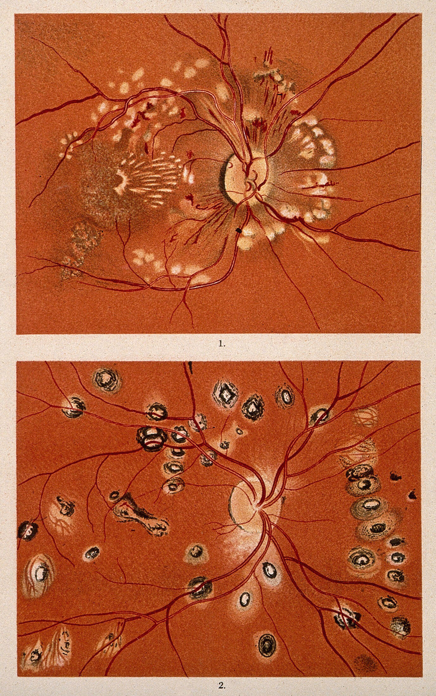
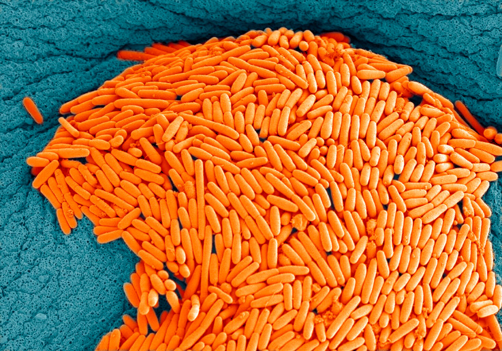

# Organization
## Things to do
#### Friday topics:
*	first session of design

#### General metadata:
* Id
* Link
* short info
* medium info
* long info

#### Metadata about the image:
*	title
*	author 
*	period 
*	technique

##### Metadata about the subject:
*	type 
*	system 
*	dimensions

## images
### Historical images: Simone
#### Id 1

#### Id 2

#### Id 3

### Diseases: Ludovica
#### Id 4

#### Id 5

#### Id 6

#### Id 7

### Systems: Alberto
#### Id 8

#### Id 9

#### Id 10

#### Id 11

#### Id 12

